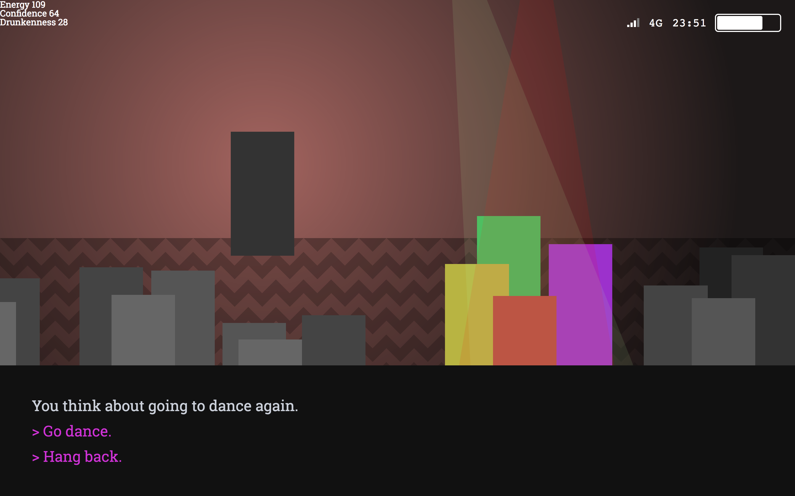

# Ludum Dare 39

_I did not complete this in time, but whatevs. It was fun to do and I may finish it up soon._

**Theme — Running Out Of Power**

## Concept

You are a wallflower at a friend's party. Your lift home is elsewhere in the house having fun. You are stuck here. Your energy is drained by interacting with other people. It is boosted by distracting yourself by doing stuff on your mobile phone, or drinking. Your phone is running out of power. And drinking makes it harder to concentrate. If you drink too much you'll be sick. If your phone runs out you'll have nothing to hide behind.

The party's lights dim as the night wears on. It feels like a spotlight is picking you out.

As your energy lowers you slouch, then to sitting on the floor. Until finally head on your knees.

To win you must make it to the end of the night, and leave arm in arm with your friend.

## Gameplay

Actions you can take appear and float over the top of the scene.

Click phone repeatedly to build up energy. If you use it too much too quickly it'll become disabled. The more you use your phone the quicker it will run out of power.

Click beer bottle to drink to build up confidence. Confidence is an energy shield. The more you drink the more the action buttons start to float around and become fuzzy.

Click interaction buttons to interact with people at the party. Not interacting with someone who has come over to you will wipe out all confidence if you have any remaining, else damage energy. Interacting with someone will damage energy but boost confidence.

## "Win" & "Lose" conditions

If you run out of energy, but have a high confidence you will end the game happy but exhausted.

If you run out of energy, and have little or no confidence, you will end the game depressed.

If you end with energy, and high confidence, you will end the game elated.

If you end with energy, and little or no confidence, you will end the game relieved.
